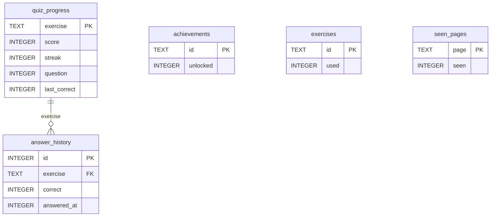

# Ear Trainer — Database ERD

SQLite database: `ear_trainer.db` (version 4)

## Mermaid ERD

## Notes

- **quiz_progress ↔ answer_history**: Logical relationship via shared `exercise` key. One quiz_progress row has many answer_history rows. No SQL foreign key enforced (sqflite).
- **achievements**: Standalone. `id` values: `first_note`, `perfect_pitch`, `pitch_veteran`, `ear_opening`, `interval_instinct`, `all_rounder`, `flawless`, `completionist`.
- **exercises**: Standalone. Tracks which exercises used. `id` values: `pitch`, `interval`, `scale`.
- **seen_pages**: Standalone. Tracks first-visit per page for onboarding.
- **Note** (`lib/models/note.dart`): Static const list, no DB table.
- All `INTEGER` boolean fields use 0/1.
- `answered_at`: epoch milliseconds.
